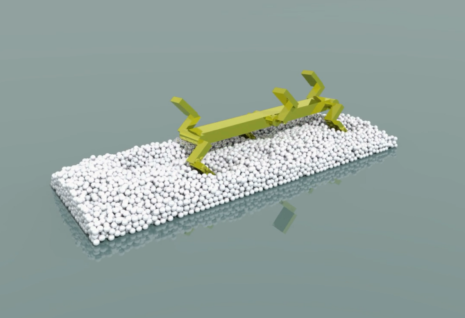

# Beetle_walker
by [Yingjie Jiang](https://yingjiejiang.com)

This is the code written in [Beijing Computational Science Research Center](http://www.csrc.ac.cn/en/), in 2016, summer.

Hexapod robot movement simulation built by [Project Chrono](https://projectchrono.org/)

Too old, lack of some support files, it doesn't compile now.

The output video of this model is [here](https://www.youtube.com/watch?v=T9bmdeVxQnY).

